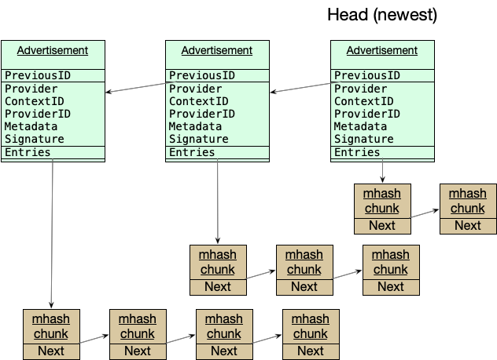

# IPNI: InterPlanetary Network Indexer


**Author(s)**:
<!-- keep names alphabetically sorted -->

- [Alfonso de la Rocha](https://github.com/adlrocha)
- [Andrew Gillis](https://github.com/gammazero)
- [David Dryjanski](https://github.com/davidd8)
- [Ivan Schasny](https://github.com/ischasny)
- [Marco Munizaga](https://github.com/marcopolo)
- [Masih Derkani](https://github.com/masih)
- [Will Scott](https://github.com/willscott)

**Maintainer(s)**:

- [Andrew Gillis](https://github.com/gammazero)
- [David Dryjanski](https://github.com/davidd8)
- [Ivan Schasny](https://github.com/ischasny)
- [Masih Derkani](https://github.com/masih)
- [Will Scott](https://github.com/willscott)

* * *

**Abstract**

This spec outlines IPNI: InterPlanetary Network Indexer as a set of protocols to discover providers
for content-addressable data, along with the protocols over which the data can be retrieved. IPNI is
designed to be extensible and support high-volume content providers with dynamically changing
retrieval address and protocol.

## Table of Contents

- [Introduction](#introduction)
- [Background](#background)
    * [Motivation](#motivation)
- [Terminology](#terminology)
- [Specification](#specification)
    * [Overview](#overview)
    * [Ingestion](#ingestion)
    * [Advertisements](#advertisements)
        + [Entries](#entries)
            - [`EntryChunk` Chain](#entrychunk-chain)
            - [HAMT](#hamt)
        + [Metadata](#metadata)
        + [ExtendedProvider](#extendedprovider)
    * [Advertisement Transfer](#advertisement-transfer)
        + [Libp2p](#libp2p)
        + [HTTP](#http)
    * [Announcements](#announcements)
        + [Gossipsub](#gossipsub)
        + [HTTP](#http-1)
    * [Querying Records](#querying-records)
        + [`GET /cid/{cid}`](#get-cidcid)
        + [`GET /multihash/{multihash}`](#get-multihashmultihash)
        + [`POST /multihash`](#post-multihash)
    * [Example Responses](#example-responses)
        + [JSON Find Response](#json-find-response)
        + [JSON Batch Find Response](#json-batch-find-response)
        + [NDJSON Streaming Records](#ndjson-streaming-records)
- [Implementations](#implementations)
- [Related Resources](#related-resources)
- [Copyright](#copyright)

## Introduction

The InterPlanetary Network Indexer (IPNI) is a content routing ecosystem that comprised of a set of
protocols that allow: 1) content providers to advertise the content they host, and 2) network
participants to facilitate content provider discovery and retrieval protocol by ingesting those
advertisements.

IPNI protocols are designed to be extensible: they are agnostic of retrieval protocol and can be
extended to support any retrieval mechanism without the need for centralised consensus, or change to
the core advertisement structure.

The advertisements are designed to offer a verifiable catalogue of content hosted by a provider over
time as a collection of [multihahses](https://github.com/multiformats/multihash). The protocol
offers support for multihash grouping, provider address change, retrieval protocol change, and
separation of content provider from content advertiser, a.k.a. publisher, without the need for
re-advertisement.

## Background

### Motivation

Filecoin stores a great deal of data; but without proper indexing of that data, clients cannot
perform efficient retrievals. On IPFS content discovery is strongly bound to the lookup performance
of DHT, which can vary significantly depending on the node and existence of Hydra Boosters.

Direct bridging of content retrieval from IPFS to Filecoin is non-trivial without significant
engineering.

> **TODO**: Add other motivation like extra info needed to enable complex retrieval scenarios like
> paid retrieval, i.e. the need for Metadata and Context ID.

## Terminology

- **Advertisement**: A record available from a publisher that contains, a link to a chain of
  multihash blocks, the CID of the previous advertisement, and provider-specific content metadata
  that is referenced by all the multihashes in the linked multihash blocks. The provider data is
  identified by a key called a context ID.
- **Announce Message**: A message that informs indexers about the availability of an advertisement.
  This is usually sent via gossip pubsub, but can also be sent via HTTP. An announce message
  contains the advertisement CID it is announcing, which allows indexers to ignore the announce if
  they have already indexed the advertisement. The publisher's address is included in the announce
  to tell indexers where to retrieve the advertisement from.
- **Context ID**: A key that, for a provider, uniquely identifies content metadata. This allows
  content metadata to be updated or delete on the indexer without having to refer to it using the
  multihashes that map to it.
- **Gossip Pubsub**: Publish/subscribe communications over a libp2p gossip mesh. This is used by
  publishers to broadcast Announce Messages to all indexers that are subscribed to the topic that
  the announce message is sent on. For production publishers and indexers, this topic
  is `"/indexer/ingest/mainnet"`.
- **Indexer**: A network node that keeps a mappings of multihashes to provider records.
- **Metadata**: Provider-specific data that a retrieval client gets from an indexer query and passed
  to the provider when retrieving content. This metadata is used by the provider to identify and
  find specific content and deliver that content via the protocol (e.g. graphsync) specified in the
  metadata.
- **Provider**: Also called a Storage Provider, this is the entity from which content can be
  retrieved by a retrieval client. When multihashes are looked up on an indexer, the responses
  contain provider that provide the content referenced by the multihashes. A provider is identified
  by a libp2p peer ID.
- **Publisher**: This is an entity that publishes advertisements and index data to an indexer. It is
  usually, but not always, the same as the data provider. A publisher is identified by a libp2p peer
  ID.
- **Retrieval Client**: A client that queries an indexer to find where content is available, and
  retrieves that content from a provider.
- **Sync** (indexer with publisher):  Operation that synchronizes the content indexed by an indexer
  with the content published by a publisher. A Sync in initiated when an indexer receives and
  Announce Message, by an administrative command to sync with a publisher, or by the indexer when
  there have been no updates for a provider for some period of time (24 hours by default).

## Specification

### Overview

The IPNI ecosystem consists of three main actors:

1. **Content providers** - participants whom host content-addressable data, also known as Storage
   Providers,
2. **IPNI nodes** - participants whom ingest announcements about the content-addressable data,
   and
3. **Retrieval clients** - participants whom find such content via indexer nodes and fetch it from
   the providers.

Content providers are responsible for cataloging and maintaining the latest list content
they host, along with the protocols over which the content is retrievable. The list of content is
represented as a chain of advertisements, signed by the content provider's identity and are
immutable. An advertisement can either represent addition or removal of content. This property
combined with the chaining of advertisement entries effectively captures a "diff" of content hosted
by the provider over time. When a change in content occurs, either new content is added or some is
removed, the provider captures the change as a new advertisement, adds it to the chain and announces
its existence to the network.

IPNI nodes are responsible for continuously listening to provider announcements. Once they receive
an announcement, they fetch the advertisement and walk its chain to effectively construct the
current list of content hosted by the provider. Because the advertisements themselves are immutable,
IPNI nodes can infer seem from unseen advertisements and only walk the portion of the chain that has
not seen before. This property enables efficient traversal of the chain and allows IPNI nodes to
tolerate very long ad chains as long as they continuously listen to advertisements and stay
relatively close to the chain's _head_, i.e. the latest advertisement in the chain.

Once an advertisement chain is processed, retrieval clients can lookup the resulting index records
vaia query API exposed by IPNI nodes. Given a CID or multihash, the API provides a list of index
records corresponding to it. Each index record captures the identity of the content provider, its
address and the protocols over which the data can be retrieved from that provider. A retrieval
client can then further filter the providers list, e.g. by protocol, and retrieve the content
directly from the providers.

The following diagram illustrates an overview of the ecosystem:


### Ingestion

There are two parts to the ingestion / providing protocol used by store the index.

1. Advertisements maintains an immutable authenticated data structure where providers describe what
   content they are have available.
2. Announcements are a transient notification that the content on a provider has changed.

The indexer reads the advertisement chain starting from the head, reading previous advertisements
until a previously seen advertisement, or the end of the chain, is reached. The advertisements and
their entries are then processed in order from earliest to head.

### Advertisements

An Advertisement is represented as an IPLD node with the following schema:

```ipldch
type Advertisement struct {
    PreviousID optional Link
    Provider String
    Addresses [String]
    Signature Bytes
    Entries Link
    ContextID Bytes
    Metadata Bytes
    IsRm Bool
    ExtendedProvider optional ExtendedProvider
}
```

* **`PreviousID`** is the CID of the previous advertisement, and is empty for the 'genesis'.
* **`Provider`** is the `peer.ID` of the libp2p host providing the content.
* **`Addresses`** are the multiaddrs to provide to clients in order to connect to the provider.
    * The provider addresses in the indexer are always updated by the latest advertisement received.
* **`Entries`** is a link to a data structure that contains the advertised multihashes.
* **`ContextID`** is an identifier used to subsequently update or delete an advertisement. It has
  the following semantics:
    * If a ContextID is used with different entries, those entries will be _added_ to the
      association with that ContextID
    * If a ContextID is used with different metadata, all previous CIDs advertised under that
      ContextID will have their metadata updated to the most recent.
    * If a ContextID is used with the `IsRm` flag set, all previous CIDs advertised under that
      ContextID will be removed.
* **`Metadata`** represents additional opaque data that is returned in client query responses for
  any of the CIDs in this advertisement. It is expected to start with a `varint` indicating the
  remaining format of metadata. The opaque data is send to the provider when retrieving content for
  the provider to use to retrieve the content. Storetheindex operators may limit the length of this
  field, and it is recommended to keep it below 100 bytes.
* **`ExtendedProvider`** is an optional field; if specified, indexers which understand
  the `ExtendedProvider` extension should ignore the `Provider`, `Addresses`, and `Metadata`
  specified in the advertisement in favor of those specified in the `ExtendedProvider`. The values
  in the direct advertisement should still be set to a compatible endpoint for content routers that
  do not understand full `ExtendedProvider` semantics.
    * `Extendedprovider` is not valid for an `IsRm` advertisement. It should be ignored if
      specified.



Multihash data is “paginated” by downloading blocks (chunks) of multihashes. These chunks are linked
together using IPLD links.

#### Entries

The Entries data structure can be one of the following:

* an interlinked chain of `EntryChunk` nodes, or
* an [IPLD HAMT ADL](https://ipld.io/specs/advanced-data-layouts/hamt/spec), where the keys in the
  map represent the multihashes and the values are simply set to true.

##### `EntryChunk` Chain

The `EntryChunk` chain is defined as the following schema:

```
type EntryChunk struct {
    Entries [Bytes]
    Next optional Link
}
```

The primary `Entries` list is the array of multihashes in the advertisement.
If an advertisement has more CIDs than fit into a single block for purposes of data transfer, they
may be split into multiple chunks, conceptually a linked list, by using `Next` as a reference to the
next chunk.

In terms of concrete constraints, each `EntryChunk` should stay below 4MB,
and a linked list of entry chunks should be no more than 400 chunks long. Above these constraints,
the list of entries should be split into multiple advertisements. Practically, this means that each
individual advertisement can hold up to approximately 40 million multihashes.

##### HAMT

The HAMT must follow the IPLD specification
of [HAMT ADL](https://ipld.io/specs/advanced-data-layouts/hamt/spec).
The HAMT data structure
is [used as a set](https://ipld.io/specs/advanced-data-layouts/hamt/spec/#use-as-a-set) to capture
the list of multihashes being advertised.
This is where the keys in the HAMT represent the multihashes being advertised, and the values are
simply set to `true`.

#### Metadata

The reference provider currently supports Bitswap and Filecoin protocols. The structure of the
metadata format for these protocols is defined
in [the library](https://github.com/filecoin-project/index-provider/tree/main/metadata).

The network indexer nodes expect that metadata begins with a `uvarint` identifying the protocol,
followed by protocol-specific metadata. This may be repeated for additional supported protocols.
Specified protocols are expected to be ordered in increasing order.

* Bitswap
    * `uvarint`
      protocol `0x0900` ([`TransportBitswap`](https://github.com/multiformats/multicodec/blob/master/table.csv#L133)
      in the multicodec table).
    * no following metadata.
* filecoin graphsync
    * `uvarint`
      protocol `0x0910`  ([`TransportGraphsyncFilecoinv1`](https://github.com/multiformats/multicodec/blob/master/table.csv#L134)
      in the multicodec table).
    * the following bytes should be a cbor encoded struct of:
        * PieceCID, a link
        * VerifiedDeal, boolean
        * FastRetrieval, boolean
* http
    * the proposed `uvarint` protocol is `0x3D0000`.
    * the following bytes are not yet defined.

If the `Metadata` field is not specified, the advertisement is treated as address update only.

#### ExtendedProvider

The `ExtendedProvider` field allows for specification of provider families, in cases where a
provider operates multiple PeerIDs, perhaps with different transport protocols between them, but
over the same database of content.

```ipldsch
type ExtendedProvider struct {
    Providers [Provider]
    Override bool
}

type Provider struct {
    ID String
    Addresses [String]
    Metadata optional Bytes
    Signature Bytes
}
```

* If `Metadata` is not specified for a `Provider`, the metadata from the
  encapsulating  `Advertisement` will be used instead.
  * If `Metadata` in encapsulating advertisement is not specified, the extended provider record 
    is treated as address update only.
* If `Addresses` are not specified, the record will be skipped and has no effect. 
* If a `Provider` listing is written with no `ContextID`, those peers will be returned for all
  advertisements published by the publisher.
    * If `Override` is set on an `ExtendedProvider` entry on an advertisement with a `ContextID`, it
      indicates that any specified chain-level set of providers should not be returned for that
      context ID. `Providers` will be returned Instead.
    * If `Override` is not set on an entry for an advertisement with a `ContextID`, it will be
      combined as a union with any chain-level `ExtendedProvider`s (Addresses, Metadata).
    * If `Override` is set on `ExtendedProvider` for an advertisement without a `ContextID`, the
      entry is invalid and should be ignored.
* The `Signature` for each of the `Providers` within an `ExtendedProvider` is signed by their
  corresponding private key.
    * The full advertisement object is serialized, with all instances of `Signature` replaced with
      an empty array of bytes.
    * This serialization is then hashed, and the hash is then signed.
    * The `Provider` from the encapsulating advertisement must be present in the `Providers` of
      the `ExtendedProvider` object, and must sign in this way as well. It may omit `Metadata`
      and `Addresses` if they match the values already set at the encapsulating advertisement.
      However, `Signature` must be present.
* Note: the `Signature` of the top level `Advertisement` is calculated as before - it should not
  include the `ExtendedProvider` field for backwards compatibility. The Additional secondary
  signature from the same `Provider` in `ExtendedProvider` ensures integrity over the full message.

### Advertisement Transfer

There are two ways that the provider advertisement chain can be made available for consumption by
indexer nodes.

1. As a [graphsync](https://github.com/ipfs/go-graphsync) endpoint on a libp2p host.
2. As a set of files fetched over HTTP.

There are two parts to the transfer protocol. The providing of the advertisement chain itself, and
a 'head' protocol for indexers to query the provider on what it's most recent advertisement is.

#### Libp2p

On libp2p hosts, graphsync is used for providing the advertisement chain.

* Graphsync is configured on the common graphsync multiprotocol of the libp2p host.
* Requests for index advertisements can be identified by
    * The use of
      a ['dagsync'](https://github.com/filecoin-project/storetheindex/blob/main/dagsync/dtsync/voucher.go#L17-L24)
      voucher in the request.
    * A CID of either the most recent advertisement, or a a specific Entries pointer.
    * A selector either for the advertisement chain, or for an entries list.

A reference implementation of the core graphsync provider is available in
the [dagsync](https://github.com/filecoin-project/storetheindex/blob/main/dagsync) package, and it's
integration into a full provider is available
in [index-provider](https://github.com/filecoin-project/index-provider).

On these hosts, a custom `head` multiprotocol is exposed on the libp2p host as a way of learning the
most recent current advertisement.
The multiprotocol is
named [`/legs/head/<network-identifier>/<version>`](https://github.com/filecoin-project/storetheindex/blob/main/dagsync/p2p/protocol/head/head.go#L40)
. The protocol itself is implemented as an HTTP TCP stream, where a request is made for the `/head`
resource, and the response body contains the string representation of the root CID.

#### HTTP

The IPLD objects of advertisements and entries are represented as files named as their CIDs in an
HTTP directory. These files are immutable, so can be safely cached or stored on CDNs.

The head protocol is the same as above, but not wrapped in a libp2p multiprotocol.
A client wanting to know the latest advertisement CID will ask for the file named `head` in the same
directory as the advertisements/entries, and will expect back
a [signed response](https://github.com/filecoin-project/storetheindex/blob/main/dagsync/httpsync/message.go#L60-L64)
for the current head.

### Announcements

Announcements signal change to the advertisement chain itself. Announcement messgaes contain:

> **TODO**: add specification of announcement message and spell out that it's encoded as CBOR with
> edge
> cases on ExtraData + OrigPeer

Indexers may be notified of changes to advertisements as a way to reduce the latency of ingestion,
and for discovery and registration of new providers.

Once indexers observe a new provider, they should adaptively poll the provider for new content,
which provides the basis of understanding what content is currently available.

The indexer will maintain a policy for when advertisements from a provider are considered valid. An
example policy may be

* A provider must be available for at least 2 days before its advertisements will be returned to
  clients.
* If a provider cannot be dialed for 3 days, it's advertisements will no longer be returned to
  clients.
* If a provider starts a new chain, previous advertisements now no longer referenced will not be
  returned after 1 day of not being referenced.
* If a provider cannot be dialed for 2 weeks, previous advertisements downloaded by the indexer will
  be garbage collected, and will need to be re-synced from the provider.

There are two ways that a provider may pro-actively alert indexer(s) of new content availability:

1. Gossipsub announcements
2. HTTP announcements

#### Gossipsub

The announcement contains the CID of the head and the multiaddr (either the libp2p host or the HTTP
host) where it should be fetched from. The format
is [here](https://pkg.go.dev/github.com/filecoin-project/storetheindex/dagsync/dtsync#Message).

It is sent over a gossip sub topic, that defaults to `/indexer/ingest/<network>`. For our production
network, this is `/indexer/ingest/mainnet`.

The dagsync provider will generate gossip announcements automatically on it's host.

#### HTTP

Alternatively, an announcement can be sent to a specific known network indexer.
The network indexer may then relay that announcement over gossip sub to other indexers to allow
broader discover of a provider choosing to selectively announce in this way.

Announcements are sent as HTTP PUT requests to `/announce` on the index node's 'ingest'
[server](https://github.com/ipni/storetheindex/blob/main/server/ingest/http/server.go#L56).
The previous `/ingest/announce` endpoint has been deprecated.
Note that the ingest server is not the same http server as the primary publicly exposed query
server. This is because the index node operator may choose not to expose it, or may protect it so
that only selected providers are given access to this endpoint due to potential denial of service
concerns.

If using an assigner service, then announcements are sent as HTTP PUT requests to `/announce` on
the assigner node's [server](https://github.com/ipni/storetheindex/blob/main/assigner/server/server.go#L48).

The body of the request put to this endpoint should be the json serialization of the
announcement [message](https://github.com/ipni/go-libipni/blob/main/announce/message/message.go#L14-L29)
that would be provided over gossip sub: a representation of the head CID, and the multiaddr of where
to fetch the advertisement chain.

### Querying Records

An indexer node can be queried over HTTP for a multihash or a CID. This section provides a summary of the HTTP query APIs. A full OpenAPI specification of the APIs can be found [here](schemas/v1/openapi.yaml).


#### Cascading Lookup

The HTTP query API supports cascading queries for a given multihash or CID onto alternative routing systems in addition to searching IPNI records.
A client may optionally specify a query parameter with key set to `cascade`, and value set to comma separated alternative routing systems, which are also searched for records.

The specification imposes no constraints on the order by which the results are returned.
Implementers are free to return results as they are found.

The alternative routing systems currently supported is:
 * `ipfs-dht`: equivalent to searching records on the IPFS network.
 * `legacy`: searches records via BitSwap broadcast over a set of peered nodes; see [Legacy Lookup Cascade](#legacy-lookup-cascade).

A client may discover the list of alternative routing systems supported by a server via sending `OPTIONS` request.
In response, the server may include `X-IPNI-Allow-Cascade` header key, with value as the comma separated list of alternative routing systems supported.
The absence of this header key implies that the server does not offer cascading lookups.

##### Legacy Lookup Cascade

The legacy lookup cascade propagates search for providers via BitSwap broadcast protocol across a list of nodes that have explicitly peered with the legacy cascade endpoint. 
A client may discover the the legacy cascade endpoints provided by a server by sending an `OPTIONS` request.
In response, the server may include `X-IPNI-Legacy-Cascade-Peering` header key, with value as a multiaddr to which to peer connections.
There may be multiple peering multiaddrs offered by a server, in which case the header key may be repeated once for each peering address.

:warning: **Scheduled to be deprecated**: this lookup cascade is scheduled to be deprecated as soon as the peered nodes advertise content in alternative ways. As a provider, consider using other methods to make content discoverable such as IPNI index provider protocol, or via the IPFS DHT. 

#### `GET /cid/{cid}`

Given a CID as path parameter, returns a list of its content providers. The lookup ignores CID codec
and uses the multihash portion of the CID only.

##### Path Parameters

* `cid` - _Required_. The default string representation of the Cid. Currently, Base32 is used for
  CIDv1 as the encoding for the multibase string and Base58 is used for CIDv0.

##### Query Parameters

* `cascade` - _Optional_. The comma separated alternative routing systems to which the lookup is cascaded in addition to searching IPNI index records. If unspecified, only IPNI index records are searched. See [Cascading Lookup](#cascading-lookup)

##### Response

* `application/json` - JSON encoded [`FindResponse`][find-response-schema]. See [JSON Find Response](#json-find-response) example.
* `application/x-ndjson` - one-per-line NDJSON encoded [`ProviderRecord`s][provider-record-schema]. See [NDJSON Streaming Records](#ndjson-streaming-records) example.

###### Status Code

* `200` - OK.
* `400` - Invalid CID.
* `404` - No provider records found for given CID.

#### `GET /multihash/{multihash}`

Given a multihash as path parameter, returns a list of its content providers.

##### Path Parameters

* `multihash` - _Required_. The Base58 string representation of multihash value.

##### Query Parameters

* `cascade` - _Optional_. The comma separated alternative routing systems to which the lookup is cascaded in addition to searching IPNI index records. If unspecified, only IPNI index records are searched. See [Cascading Lookup](#cascading-lookup)


##### Response

* `application/json` - JSON encoded [`FindResponse`][find-response-schema]. See [JSON Find Response](#json-find-response) example.
* `application/x-ndjson` - one-per-line NDJSON encoded [`ProviderRecord`s][provider-record-schema]. See [NDJSON Streaming Records](#ndjson-streaming-records) example.


###### Status Code

* `200` - OK
* `400` - Invalid multihash.
* `404` - No provider records found for given multihash.

#### `POST /multihash`

Given a list of multihashes as request body, batch finds the list of their content providers.

##### Request

_Required_. JSON encoded list of multihashes to look up, where each multihash is encoded as its
Base58 string representation. See [`FindRequest`][find-request-schema] schema.

###### Example

```json
{
  "Multihashes": [
    "EiDVNlzli2ONH3OslRv1Q0BRCKUCsERWs3RbthTVu6Xptg==",
    "oOQCIPNDQHkqUhHx5pVtF6ijer8cljI1oJ0oh710UqcamtuP"
  ]
}
```

##### Query Parameters

* `cascade` - _Optional_. The comma separated alternative routing systems to which the lookup is cascaded in addition to searching IPNI index records. If unspecified, only IPNI index records are searched. See [Cascading Lookup](#cascading-lookup)


##### Response

* `application-json` - JSON encoded [`FindResponse`][find-response-schema]. See [JSON Batch Find Response](#json-batch-find-response) example.

###### Status Code

* `200` - OK
* `400` - Invalid multihash.
* `404` - No provider records found for given multihash.

### Example Responses

#### JSON Find Response

The snippet blow shows a formatted JSON response to a find query for a single multihash that resulted in two provider records being found:

```json
{
  "MultihashResults": [
    {
      "Multihash": "EiDVNlzli2ONH3OslRv1Q0BRCKUCsERWs3RbthTVu6Xptg==",
      "ProviderResults": [
        {
          "ContextID": "YmFndXFlZXJha3ppdzRwaWxuZmV5ZGFtNTdlZ2RxZTRxZjR4bzVuZmxqZG56emwzanV0YXJtbWltdHNqcQ==",
          "Metadata": "gBI=",
          "Provider": {
            "ID": "QmQzqxhK82kAmKvARFZSkUVS6fo9sySaiogAnx5EnZ6ZmC",
            "Addrs": [
              "/dns4/elastic.dag.house/tcp/443/wss"
            ]
          }
        },
        {
          "ContextID": "AXESID1YhQwxum55WMSHXI6EQbtVpnhm7QwGpDPYCm5bjwbr",
          "Metadata": "kBKjaFBpZWNlQ0lE2CpYKAABgeIDkiAg7H0Gb8ZK4LC8aijKk56XS4diZvoLv9hcDz6iiE0gJhNsVmVyaWZpZWREZWFs9W1GYXN0UmV0cmlldmFs9Q==",
          "Provider": {
            "ID": "12D3KooW9yi2xLhXds9HC4x9vRN99mphq6ds8qN2YRf8zks1F32G",
            "Addrs": [
              "/ip4/149.5.22.10/tcp/24002"
            ]
          }
        }
      ]
    }
  ]
}
```

#### JSON Batch Find Response

The snippet blow shows a formatted JSON response to a batch find query for two multihashes that resulted in two provider records being found for one multihash and one record for the other:

```json
{
  "MultihashResults": [
    {
      "Multihash": "EiDVNlzli2ONH3OslRv1Q0BRCKUCsERWs3RbthTVu6Xptg==",
      "ProviderResults": [
        {
          "ContextID": "YmFndXFlZXJha3ppdzRwaWxuZmV5ZGFtNTdlZ2RxZTRxZjR4bzVuZmxqZG56emwzanV0YXJtbWltdHNqcQ==",
          "Metadata": "gBI=",
          "Provider": {
            "ID": "QmQzqxhK82kAmKvARFZSkUVS6fo9sySaiogAnx5EnZ6ZmC",
            "Addrs": [
              "/dns4/elastic.dag.house/tcp/443/wss"
            ]
          }
        },
        {
          "ContextID": "AXESID1YhQwxum55WMSHXI6EQbtVpnhm7QwGpDPYCm5bjwbr",
          "Metadata": "kBKjaFBpZWNlQ0lE2CpYKAABgeIDkiAg7H0Gb8ZK4LC8aijKk56XS4diZvoLv9hcDz6iiE0gJhNsVmVyaWZpZWREZWFs9W1GYXN0UmV0cmlldmFs9Q==",
          "Provider": {
            "ID": "12D3KooW9yi2xLhXds9HC4x9vRN99mphq6ds8qN2YRf8zks1F32G",
            "Addrs": [
              "/ip4/149.5.22.10/tcp/24002"
            ]
          }
        }
      ],
      "Multihash": "oOQCIPNDQHkqUhHx5pVtF6ijer8cljI1oJ0oh710UqcamtuP",
      "ProviderResults": [
        {
          "ContextID": "AXESIHKH83SGwMdaaJZfXNu6yXZtNHLUHT+llGMryKHXG8Wb",
          "Metadata": "gBKQEqNoUGllY2VDSUTYKlgoAAGB4gOSICAYVAKmPqL1mpkiiDhd9iBaXoU/3rXorXxzjiyESP4hB2xWZXJpZmllZERlYWz0bUZhc3RSZXRyaWV2YWz1",
          "Provider": {
            "ID": "12D3KooWE8yt84RVwW3sFcd6WMjbUdWrZer2YtT4dmtj3dHdahSZ",
            "Addrs": [
              "/ip4/85.11.148.122/tcp/24001"
            ]
          }
        }
      ]
    }
  ]
}
```

#### NDJSON Streaming Records

The snippet below shows one-per-line provider records found in response to a lookup:

```json lines
{"ContextID":"aXBmcy1kaHQtY2FzY2FkZQ==","Metadata":"gBI=","Provider":{"ID":"12D3KooWHVXoJnv2ifmr9K6LWwJPXxkfvzZRHzjiTZMvybeTnwPy","Addrs":["/ip4/145.40.89.101/tcp/4001","/ip4/145.40.89.101/tcp/4002/ws","/ip4/145.40.89.101/udp/4001/quic","/ip6/2604:1380:45f1:d800::1/tcp/4001","/ip6/2604:1380:45f1:d800::1/tcp/4002/ws","/ip6/2604:1380:45f1:d800::1/udp/4001/quic"]}}

{"ContextID":"aXBmcy1kaHQtY2FzY2FkZQ==","Metadata":"gBI=","Provider":{"ID":"12D3KooWDpp7U7W9Q8feMZPPEpPP5FKXTUakLgnVLbavfjb9mzrT","Addrs":["/ip4/147.75.80.75/tcp/4001","/ip4/147.75.80.75/tcp/4002/ws","/ip4/147.75.80.75/udp/4001/quic","/ip6/2604:1380:4601:f600::5/tcp/4001","/ip6/2604:1380:4601:f600::5/tcp/4002/ws","/ip6/2604:1380:4601:f600::5/udp/4001/quic"]}}

{"ContextID":"aXBmcy1kaHQtY2FzY2FkZQ==","Metadata":"gBI=","Provider":{"ID":"12D3KooWCrBiagtZMzpZePCr1tfBbrZTh4BRQf7JurRqNMRi8YHF","Addrs":["/ip4/147.75.87.65/tcp/4001","/ip4/147.75.87.65/tcp/4002/ws","/ip4/147.75.87.65/udp/4001/quic","/ip6/2604:1380:4601:f600::1/tcp/4001","/ip6/2604:1380:4601:f600::1/tcp/4002/ws","/ip6/2604:1380:4601:f600::1/udp/4001/quic"]}}
```

## Implementations

The following lists the libraries and implementations of IPNI protocol:

- [`ipni/storetheindex`](https://github.com/filecoin-project/storetheindex) - Indexer node
  implementation in Golang
- [`ipni/index-provider`](https://github.com/filecoin-project/index-provider) - Golang libraries to
  advertise content to IPNI nodes.
- [`elastic-ipfs/indexer-labda`](https://github.com/elastic-ipfs/indexer-lambda) - A service to
  advertise content from CAR files using AWS Lambda.
- [`MarcoPolo/http-index-provider-example`](https://github.com/MarcoPolo/http-index-provider-example)
  An example HTTP index provider using HTTP protocol in Rust.

## Related Resources

> **TODO**: Catalog any other links a reader might find useful.

## Copyright

Copyright and related rights waived via [CC0](https://creativecommons.org/publicdomain/zero/1.0/).

[find-response-schema]: schemas/v1/openapi.yaml#L120
[provider-record-schema]: (schemas/v1/openapi.yaml#L136)
[find-request-schema]: schemas/v1/openapi.yaml#L156
