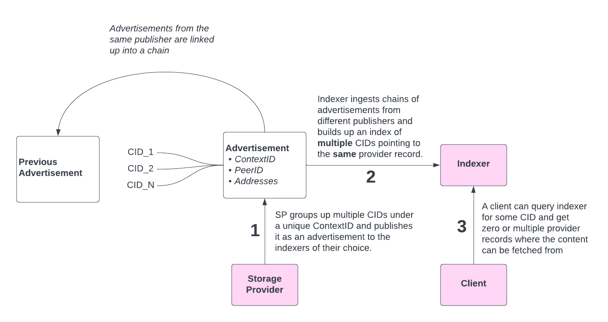
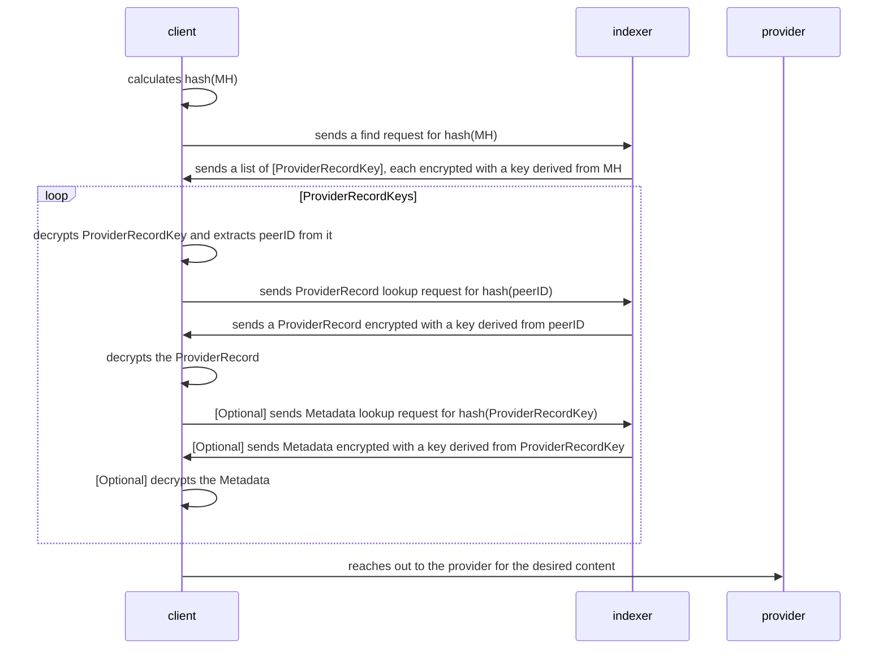

# Reader Privacy Preservation
​

​

**Author(s)**:
<!-- keep names alphabetically sorted -->
​
- [Andrew Gillis](https://github.com/gammazero)
- [Ivan Schasny](https://github.com/ischasny)
- [Masih Derkani](https://github.com/masih)
- [Will Scott](https://github.com/willscott)
​

**Maintainer(s)**:
​
- [Andrew Gillis](https://github.com/gammazero)
- [Ivan Schasny](https://github.com/ischasny)
- [Masih Derkani](https://github.com/masih)
- [Will Scott](https://github.com/willscott)
​
* * *
​
**Abstract**

The lookup APIs provided by IPNI nodes are able to observe what data is being accessed by the clients.
This is true regardless of whether the data itself is public or not. Because IPNI nodes continuously
catalogue the content hosted by all the providers, and provide a central lookup API the need for
reader privacy is amplified. This makes IPNI a difficult choice as an alternative routing system in
projects such as IPFS, which use a more decentrailsed routing system that by nature reduces the
possibility of mass query snooping.
​
There is ongoing work on IPFS side to integrate a reader privacy technique, a.k.a, double hashing.
Building on top of the existing approach, this document specifies how a similar technique is applied
to IPNI in order to preserve the reader's privacy while continuing to facilitate low-latency
provider lookup.
​
## Table of Contents

- [Introduction](#introduction)
- [Background](#background)
- [Specification](#specification)
    - [Security](#security)
        - [Hashing and Encryption Function Upgrades](#hashing-and-encryption-function-upgrades)
    - [Trade Offs](#trade-offs)
    - [Threat Modelling](#threat-modelling)
- [Implementation](#implementation)
    - [Hashing](#hashing)
    - [Encryption](#encryption)
    - [Data Formats](#data-formats)
- [Related Resources](#related-resources)

For more technical implementation details please see the [Addendum](reader-privacy-addendum.md).
​
## Introduction
​
IPFS is currently lacking of many privacy protections. One of its main weak points lies in the lack 
of privacy protections for the content routing subsystem. Currently neither readers (clients accessing files) 
nor writers (hosts storing and distributing content) have much privacy with regard to content they publish or 
consume. It is very easy for a content router node or a passive observer to learn which file is requested by 
which client during the routing process, as the potential adversary easily learns about the requested `CID`. 
A curious actor could request the same `CID` and download the associated file to monitor the user’s behavior. 
This is obviously undesirable and has been for some time now a strong request from the community.

The changes described in this specification introduce a IPNI Readres Privacy upgrade. It will prevent 
passive observers from tracking user's actions as described above. It will also be a first step towards
fully private IPNI protocol that will eliminate indexers as centralised observers.  

### Non Goals

* Writer, i.e. content provider or publisher, Privacy, which will be done in a separate specification
* Retrieval Privacy, which is out of scope for the content routing subsystem.
​
## Background
​
Network indexers build their indexes by ingesting chains of Advertisements. Advertisement is a
construct that allows Storage Providers to publish their CIDs in bulk (FIL deals) instead of doing
that individually for each CID. A group of CIDs is represented by a unique ContextID as can be seen
on the diagram below:
​

## Specification
​
This specification improves the reader privacy by proposing changes to the Step 3, depicted above, where the client 
supplies the content CID directly in order to lookup its corresponding providers.

In order to protect the reader's privacy the proposal changes the way CID lookup works to the following:

* A client who wants to do a lookup will calculate a hash over the CID's multihash (`hash(MH)`) and use it for the
lookup query (hence the name double hashing);
* In response to the hashed find request, the indexer will return a set of encrypted `ProviderRecordKey`s. 
`ProviderRecordKey` will consist of the `peerID` concatenated with `contextID`. 
Each `ProviderRecordKey` will be encrypted with a key derived from the *original* multihash value: 
`enc(peerID || contextID, MH)`, where `hash` is a hash over the value, and `||` is concatenation 
and `enc` is encryption over the value. In order to make sense of that payload, a passive observer would need 
to get hold of the original CID that isn't revealed during the communication round;
* Using the original multihash, the client will decrypt `ProviderRecordKey`s and then calculate a hash
over the decrypted `peerID` part of it. Using `hash(peerID)` for each `ProviderRecordKey` the client would do another lookup 
round to get an encrypted `ProviderRecord` in response: `enc(ProviderRecord, peerID)`. `ProviderRecord` will contain provider's 
*multiaddrs* with other possible provider-related information in the future.
 Each `ProviderRecord` will be encrypted with a key derived from their `peerID`. In order to make sense of that payload, a passive observer would need to 
get hold of the original `peerID` that isn't revealed during the communication round. It's important to note that
`ProviderRecord`s are cacheable and hence this rountrip can be avoided most of the times;
* Using a key derived from the `peerID`, the client will decrypt `ProviderRecord`s and then reach out to the 
provider directly to fetch the desired content. 
* The client might choose to fetch additional `Metadata` that is supplied to IPNI in Advertisements.
That will require another lookup by `hash(ProviderRecordKey)` to get `enc(Metadata, ProviderRecordKey)` in response. 

By utilising such scheme only a party that knows original CID can decode the protocol,
and that CID is never revealed. 

### Security
​
Security model of the Reader Privacy proposal boils down to inability of an attacker to *algorithmically* derive the original multihash value from 
`hash(multihash)` that is used for IPNI lookups. IPNI advertisments are not encrypted, but authenticated and contain plain multihash values in them.
Before Writer Privacy is implemented an attacker could build a map of `hash(multihash) -> multihash` 
by re-ingesting advertisements chain from each publisher in order to collect all original multihashes which can then be used to decrypt provider records and so on. 
Doing that will require significant resources as it involves crawling the entire network. However, it will eventually be eliminated by *Writer Privacy* upgrade.

Reader Privacy is a first step towards fully private content routing protocol. 

Wider security implications are discussed in the IPFS Reader Privacy specification: TODO link here.

#### Hashing and Encryption Function Upgrades

All multihashes have a codec encoded in them. If a hashing or encryption funciton will have to rotate then different types of multihahses can coexist together
and can be processed differently by IPNI implementations. It won't be possible to apply a fix retroactivelly to the data returned by previous lookup requests, 
however IPNI implementations can start blocking all new ones that use a compromised scheme, allowing some transtition period. 

Moving an IPNI implementation to a new hash / encryption function will require reingesting all data from a scratch. Before Writer Privacy is impemented the 
index can be migrated over to new functions by reingesting existing advertisement chains. With Writer Privacy, Publishers will have to republish advertisments 
using new functions (as the data in the advertisements themselves will have to be re-hashed / re-encrypted). Both old and new scheme can coexist together for some time. 
The old scheme should be retired either immediately or once the indexes have been rebuilt and the users have been migrated over. 

An exact operational procedure will be different for differnet IPNI implementations.

### Trade Offs 

* **Multiple lookups**. In the simplest scenario Reader Privacy protocol will require at least two roundtrips to find provider details for a given CID.
It can be reduced down to one by caching `ProviderRecord`s at the client side, which would eliminate a need in a lookup
per decrypted `ProviderRecordKey`. In the future there can be a separate service that distributes `PeerID` to `Multiaddresses` mappings in open.
That dataset can be periodically downloaded by all clients and cached locally;

* **Extra compute**. At minimum, clients will require to perform an extra hashing per CID and decryption per `ProviderRecordKey` that will add
some overhead to each lookup. That overhead can be initially offloaded to the server but will have to be done by clients eventually (explained below);

* **Extra storage space**. Storing encrypted data will require more space due to paddings and nonce;

* **Bulk deletes**. Encrypted `PeerID` will be different for each multihash and hence bulk delete operations (delete everything for a provider X) will not be possible.

* **Operational overhead**. Reader Privacy roll out will be a gradual process as many clients will have to migrate over. During the transition period 
IPNI implementations will have to serve both plain and hashed lookups. That will involve either:   
    - spinning up separate IPNI instances for hashed queries or;
    - serving hashed and regular queries from the same instances using encrypted dataset. That means that servers will have to do decryption on behalf of their clients
    using a plain multihash that has been provided in the lookup request;

* **Data Migration**. Existing indexes will have to undergo data migration or to be wiped out complletely and rebuilt again. 

### Threat Modelling

There are three actors involved into the IPNI workflow: provider, client and indexer. Providers update index by publishing advertisements.
Indexer advertisements are signed by their publishers and can be authenticated. Advertisements are organised in a chain and are ingested strictly in order. 
It's not possible to reorder advertisements wihtout forking the chain. Advertisements processing is idempotent - re-ingesting the same advertismeent twice 
shouldn't affect the indexer's state. The IPNI specification is agnostic to transport protocols so particular protocol choice is up to the implementation. 
Compromised publisher's identity is out of scope of this specification.

Clients consume index by performing CID lookups. This specification introduces additional hashing and encryption that aim to prevent a passive observer
from being able to infer what data is being looked up by spying at the client to indexer traffic. The exact communicaton protocol is out of scope for this specification 
however it should be chosen carefully to prevent MITM attacks. Before Writer Privacy upgrade a passive observer could deobfuscate the content by building a `hash(Multihash)` to `Multihash` map.
That however will not be possible eventually as mentioned in the [Security](#security) section. 

Provider records returned to client lookups do not contain any authentication data. It's possible for a malicious / buggy indexer to  
present a wrong dataset to the client. Clients can tackle that problem by excluding such indexers from their pool. Returning wrong datasets will
eventually affect the indexer's reputation score - these efforts are already in progress. Data integrity is inbuilt into IPFS - clients
can verify that the data returned by a storage provider matches the CID. So even if indexer get compromised that will not compromise
the data itself. 

## Implementation

This section goes through Reader Privacy protocol, hashing and cryptography choices as well as explains some less obvious details 
for the implementations to consider.

### Hashing

SHA256 must be used as a hashing function. To avoid collisions between the hashes calculated from the same value but for different purposes (for example
to derive an encryption key versus derive a lookup key) a constant string can be appended to the value before calculating a hash over it. For example
`sha256("AESGCM" + multihash)` to derive an encryption key and `sha256("CR_DOUBLEHASH" + multihash)` to calculate a second hash over the multihash.

All hashed data that is used for lookups must be of `Multihash` format with `SHA_256` codec. Double hashed data must use `DBL_SHA_256` codec.

Multihashes must be prepended with `CR_DOUBLEHASH` before calculating a second hash. Unhashed data must be prepended with `CR_HASH` before calculating the first hash.

### Encryption

AES in GCM mode must be used for encryption. AES keys must be 32-bytes long and be derived from the passpharse by calculating a SHA256 over it. AES keys must be prepended with `AESGCM` before hashing them over.
One particular detail - is a careful choice of 12-byte IV. IPNI expects an explicit instruction to delete a record (comparing to the DHT where records expire).
Hence the IPNI server needs to be able to compare encrypted values without having to decrypt them as that would require a key that it is unaware of.
That means that the IV needs to be deterministically chosen so that `enc(IV, passphrase, payload)` produces the same output for the same 
passpharase + payload pair. One strategy could be to deterministically derive an IV from the passphrase or to generate it randomly and store 
the mapping on the client side. The IPNI specification doesn't enforce how an IV should be chosen and leaves that up to the client to decide. 

Encrypted payload must have nonce encoded in it: `nonce || enc(payload)`, where `nonce` is 12 bytes long.

### Data Formats

* All binary data must be b58 encoded when transferred over the wire. 
* `ProviderRecordKey`s must be created by concatenating binary `PeerID` with binary `ContextID`. There is no need for extra length / separators as they are
already encoded as a part of the `Multihash` format.

## Related Resources
​
TODO: link to corresponding IPFS spec once materialised.
​
* [Double Hashing and Content Routing](https://youtu.be/ZPIDU1-JnVc)
* [Duble Hashing as a way to increase reader privacy](https://youtu.be/VBlx-VvIZqU)
* [Deployment and transition options of Double Hashing](https://youtu.be/m-6_VZ8e1tk)
​
## Copyright
​
Copyright and related rights waived via [CC0](https://creativecommons.org/publicdomain/zero/1.0/).