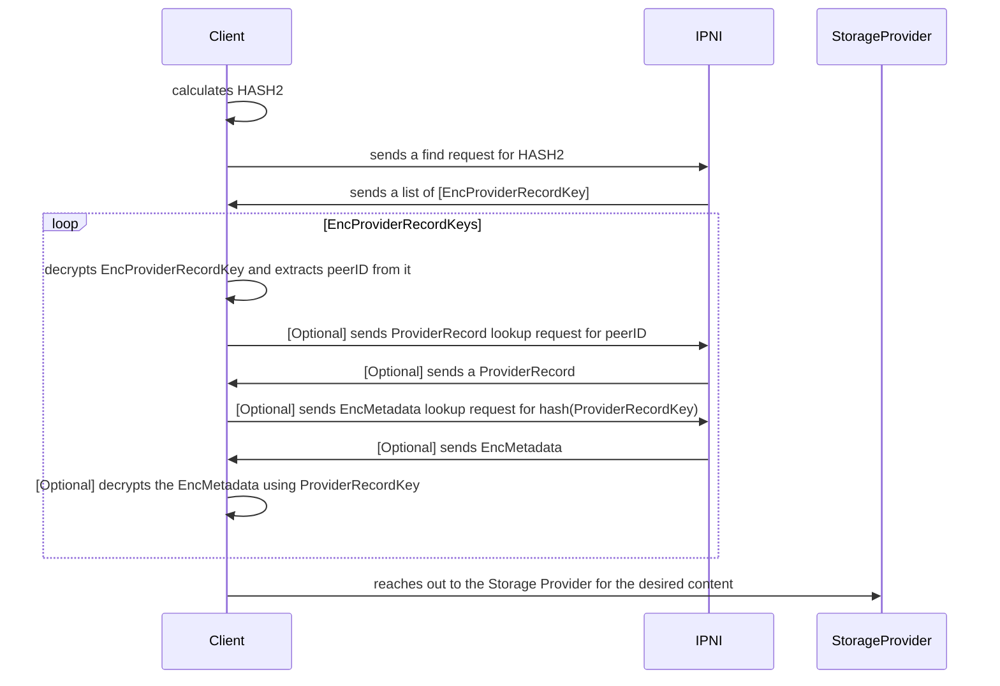

# Reader Privacy Preservation
​

​

**Author(s)**:
<!-- keep names alphabetically sorted -->
​
- [Andrew Gillis](https://github.com/gammazero)
- [Ivan Schasny](https://github.com/ischasny)
- [Masih Derkani](https://github.com/masih)
- [Will Scott](https://github.com/willscott)
​

**Maintainer(s)**:
​
- [Andrew Gillis](https://github.com/gammazero)
- [Ivan Schasny](https://github.com/ischasny)
- [Masih Derkani](https://github.com/masih)
- [Will Scott](https://github.com/willscott)
​
* * *
​
**Abstract**

The lookup APIs provided by IPNI nodes are able to observe what data is being accessed by the clients.
This is true regardless of whether the data itself is public or not. Because IPNI nodes continuously
catalogue the content hosted by all the providers, and provide a central lookup API the need for
reader privacy is amplified. This makes IPNI a difficult choice as an alternative routing system in
projects such as IPFS, which use a more decentrailsed routing system that by nature reduces the
possibility of mass query snooping.
​
Building on top of IPFS's reader privacy mechanism, a.k.a, double-hashing, this document specifies how
a similar technique is applied to IPNI in order to preserve the reader's privacy while continuing to
facilitate low-latency provider lookup.
​
## Table of Contents

- [Introduction](#introduction)
- [Background](#background)
- [Specification](#specification)
    - [Extended Providers](#extended-providers)
    - [Security](#security)
        - [Hashing and Encryption Function Upgrades](#hashing-and-encryption-function-upgrades)
    - [Trade Offs](#trade-offs)
    - [Threat Modelling](#threat-modelling)
- [Implementation](#implementation)
    - [Hashing](#hashing)
    - [Encryption](#encryption)
    - [Data Formats](#data-formats)
- [Related Resources](#related-resources)

For more technical implementation details please see the [Addendum](reader-privacy-addendum.md).
​
## Introduction
​
IPFS requires various privacy protections, which includes privacy for the content routing subsystem. Readers
(clients accessing files) need privacy for the content they consume and writers (hosts storing and
distributing content) need privacy for the content they publish. It is very easy for a content router node or
a passive observer to learn which file is requested by which client during the routing process, as the
potential adversary easily learns about the requested `CID`. A snooping actor could request the same `CID`
and download the associated file to monitor the user’s behavior. This is obviously undesirable and has been
for some time now a strong request from the community.

This specification describes how IPNI provides Readers Privacy. It prevents passive observers from tracking a user's
actions as described above.

### Non Goals

* Writer, i.e. content provider or publisher, Privacy, which will be done in a separate specification;
* Retrieval Privacy, which is out of scope for the content routing subsystem;
* Rogue IPNI behaviour (explained in the [Security](#security) section).
​
## Background
​
IPNI builds its indexes by ingesting chains of Advertisements. Advertisement is a
construct that allows Storage Providers to publish their CIDs in bulk (FIL deals) instead of doing
that individually for each CID. A group of CIDs is represented by a ContextID that is unique per provider as can be seen
on the diagram below:
​

## Magic Values

All salts below are 64-bytes long, and represent a string padded with `\x00`.

- `SALT_DOUBLEHASH = bytes("CR_DOUBLEHASH\x00\x00\x00\x00\x00\x00\x00\x00\x00\x00\x00\x00\x00\x00\x00\x00\x00\x00\x00\x00\x00\x00\x00\x00\x00\x00\x00\x00\x00\x00\x00\x00\x00\x00\x00\x00\x00\x00\x00\x00\x00\x00\x00\x00\x00\x00\x00\x00\x00\x00\x00")`
- `SALT_ENCRYPTIONKEY = bytes("CR_ENCRYPTIONKEY\x00\x00\x00\x00\x00\x00\x00\x00\x00\x00\x00\x00\x00\x00\x00\x00\x00\x00\x00\x00\x00\x00\x00\x00\x00\x00\x00\x00\x00\x00\x00\x00\x00\x00\x00\x00\x00\x00\x00\x00\x00\x00\x00\x00\x00\x00\x00\x00")`
- `SALT_NONCE = bytes("CR_NONCE\x00\x00\x00\x00\x00\x00\x00\x00\x00\x00\x00\x00\x00\x00\x00\x00\x00\x00\x00\x00\x00\x00\x00\x00\x00\x00\x00\x00\x00\x00\x00\x00\x00\x00\x00\x00\x00\x00\x00\x00\x00\x00\x00\x00\x00\x00\x00\x00\x00\x00\x00\x00\x00\x00\x00\x00")`

## Definitions

- **Advertisement** is [IPNI Advertisement](https://github.com/ipni/go-libipni/blob/main/ingest/schema/schema.ipldsch#L40).
- **Storage Provider** is a party who stores the data and wants that data to be discoverable through IPNI.
- **Publisher** is a party who publishes multihashes, via Advertisements, to IPNI on behalf of a Storage Provider.
- **Client** is a party who wants to find the content by its CID using IPNI for the purpose of retreiving from the Storage Provider.
- **Passive Observer** is a snooping party that wants to understand what content is being looked up by observing Client-to-IPNI traffic.
- **`enc`** is [AESGCM](https://en.wikipedia.org/wiki/Galois/Counter_Mode) encryption. The following notation will be used for the rest of the specification `enc(passphrase, nonce, payload)`.
- **`hash`** is [SHA256](https://en.wikipedia.org/wiki/SHA-2) hashing.
- **`||`** is concatenation of two values.
- **`deriveKey`** is deriving a 32-byte encryption key from a passphrase that is done as `hash(SALT_ENCRYPTIONKEY || passphrase)`.
- **`Nonce`** is a 12-byte nonce used as Initialization Vector (IV) for the AESGCM encryption. IPNI expects an explicit instruction to delete a record (comparing to the DHT where records expire).
Hence the IPNI server needs to be able to compare encrypted values without having to decrypt them as that would require a key that it is unaware of.
That means that the nonce has to be deterministically chosen so that `enc(passphrase, nonce, payload)` produces the same output for the same 
`passpharase` + `payload` pair. Nonce must be calculated as `hash(SALT_NONCE || passphrase || len(payload) || payload)[:12]`, where `len(payload)` is 
an 8-byte length of the `payload` encoded in Little Endian format. Choice of nonce is not enforced by the IPNI specification. The described approach will be used while IPNI encrypts Advertisements on behaf of Publishers. However once Writer Privacy is implemented, the choice of nonce will be left up to the Publisher. 
- **`CID`** is the [Content IDentifier](https://github.com/multiformats/cid).
- **`MH`** is the [Multihash](https://github.com/multiformats/multihash) contained in a `CID`. It corresponds to the digest of a hash function over some content. `MH` is represented as a 32-byte array.
- **`HASH2`** is a second hash over the multihash. Second Hashes must be of `Multihash` format with `DBL_SHA_256` codec. The digest must be calculated as `hash(SALT_DOUBLEHASH || MH)`.
- **`ProviderRecord`** is a data structure that contains such information about Storage Provider as ther PeerID and Addresses.
- **`ProviderRecordKey`** is a concatentation of `peerID || contextID`. There is no need for explicitly encoding lengths as they are already encoded as a part of the multihash format. 
- **`EncProviderRecordKey`** is `Nonce || enc(deriveKey(multihash), Nonce, ProviderRecordKey)`.
- **`HashProviderRecordKey`**  is a hash over `ProviderRecordKey` that must be calculated as `hash(SALT_DOUBLEHASH || ProviderRecordKey)`.
- **`Metadata`** is IPNI metadata that is supplied in Advertisements.
- **`EncMetadata`** is `Nonce || enc(deriveKey(ProviderRecordKey), Nonce, Metadata)`.

## Specification
​
This specification improves Reader Privacy by making changes to the Step 3, depicted above, where the Client 
supplies the multihash (or CID) to IPNI in order to lookup corresponding Storage Providers.

* A Client who wants to do a lookup will calculate `HASH2` and use it for the lookup query;
* In response to that IPNI will return a list of `EncProviderRecordKey`s that containencrypted `peerID` and `contextID` of the Storage Providers that have the content represented by the original `MH`.
In order to make sense of that payload, a Passive Observer would need 
to get hold of the original `MH` that isn't revealed during this communication round;
* Using the original `MH`, the Client decrypts `EncProviderRecordKey`s and uses the `peerID` to fetch a `ProviderRecord`. `ProviderRecord`s can be cached on the Client side and hence this rountrip can be avoided most of the times.
Peer addresses can also be discovered through alternative sources such as libp2p peerstore;
* Using addresses from the `ProviderRecord` the Client will reach out to the Storage Provider directly and fetch the desired content; 
* The Client might choose to fetch IPNI Metadata that will require another lookup round by `HashProviderRecordKey` to get `EncMetadata` in response. 

By utilising such scheme only a party that knows the original CID can decode the protocol,
which is never revealed. 

### Extended Providers

[Extended Providers](https://github.com/ipni/specs/blob/main/IPNI.md#extendedprovider) allow a Publisher to add an extra information to all their past and future Advertisements 
or to a single Advertisement with a specific `ContextID`. That can be done by sending just a single Advertisement without having to re-publish the whole Advertisement chain. 
If present Extended Providers are applied to the IPNI output on the server which results into more `ProviderRecord`s being returned to the user. Same will not be possible 
for privacy preserving lookups as the required fields such as `PeerID` and `ContextID` are opaque to the server. 

While the mechanics stays the same, applying Extended Providers to the decrypted values will have to be done at the Client side. If exist, Extended Providers should be included 
as a field in the `ProviderRecord` which would make them cacheable too. 

### Security
​
Security model of the Reader Privacy proposal boils down to inability of a Passive Observer to *algorithmically* derive the original `MH` from 
`HASH2` that is used for IPNI lookups. IPNI Advertisments are not encrypted, but authenticated and contain plain multihash values in them.
Before Writer Privacy is implemented a Passive Observer could build a map of `HASH2 -> MH` 
by re-ingesting Advertisements chain from each Publisher in order to collect all original multihashes which can then be used to decrypt `EncProviderRecord`s and so on. 
Doing that will require significant resources as it involves crawling the entire network. Eliminating this requires a Writer Privacy upgrade.

Even with both Reader and Writer Privacies in place a rogue IPNI actor might abuse this security model. For example:
* Someone wants to detect who is looking for a particular piece of content, i.e. surveilling content. For example, an IPNI endpoint that wants to know how 
frequently people are requesting some website it cares about;
* Someone wants to do mass surveillance on readily accessible data. For example, a group running an IPNI endpoint also runs web crawlers looking for IPFS links, 
or runs a public HTTP gateway and can log those requests.

Rogue IPNI behaviour will be addressed by IPNI writer privacy and reputation system that is out of scope for this specification. 

Reader Privacy is a first step towards fully private content routing protocol. 

Wider security implications are discussed in the [IPFS Reader Privacy specification](https://github.com/guillaumemichel/specs/blob/double-hashing-dht/IPIP/0373-double-hash-dht.md): TODO update the link once the PR is merged.

#### Hashing and Encryption Function Upgrades

All multihashes contain a codec. If a hashing or encryption funciton will have to rotate then different types of multihahses can coexist together
and can be processed differently by IPNI implementations. It will not be possible to apply a fix retroactivelly to the data returned by previous lookup requests, 
however IPNI implementations can start blocking all new ones that use a compromised scheme, allowing some transtition period. 

Moving an IPNI implementation to a new hash / encryption function will require reingesting all data from the beginning of its publication. Before Writer Privacy is impemented the 
index can be migrated over to new functions by reingesting existing Advertisement chains. With Writer Privacy, Publishers will have to republish Advertisments 
using new functions (as the data in the Advertisements themselves will have to be re-hashed / re-encrypted). Both old and new scheme can coexist together for some time. 
The old scheme should be retired either immediately or once the indexes have been rebuilt and the users have been migrated over. 

An exact operational procedure will be different for differnet IPNI implementations.

### Trade Offs 

* **Multiple lookups**. In the best case scenario Reader Privacy protocol will require one roundtrip to get a list of peers for a given CID. 
Worst case scenario, when both `ProviderRecord`s and `Metadata`s need to be fetched from IPNI, will require 3+ lookups.

* **Extra compute**. At minimum, Clients must perform an extra hash computation per CID and decryption per `ProviderRecordKey` that will add
some overhead to each lookup. 

* **Extra storage space**. Storing encrypted data will require more space due to padding and nonce;

* **Bulk deletes**. Encrypted `PeerID` will be different for each multihash and hence bulk delete operations (delete everything for a provider X) will not be possible. Such deletion will require a garbage collection mechanism that rereads deleted advertisements and deletes the HASH2 for all multihashes.

* **Operational overhead**. Reader Privacy roll out will be a gradual process as many clients will have to migrate over. During the transition period 
IPNI implementations will have to serve both plain and hashed lookups. That will involve either serving hashed and regular queries from the same instances. Servers will have to do decryption on behalf of their clients using a plain multihash that has been provided in the lookup request;

* **Data Migration**. Existing indexes will have to re-ingest all index content that they want to provide Reader Privacy for.

### Threat Modelling

There are three actors involved into the IPNI workflow: Publisher, Client and IPNI. Publishers makes update to indexes by publishing Advertisements.
Advertisements are signed by their Publishers and can be authenticated. Advertisements are organised in a chain and are ingested strictly in order. 
It's not possible to reorder Advertisements wihtout having to fork the chain. Advertisements processing is idempotent - re-ingesting the same Advertismeent twice 
doesn't affect IPNI state. The IPNI specification is agnostic to transport protocols so particular protocol choice is up to the implementation. 
Compromised Publisher's identity is out of scope of this specification.

Clients consume index by performing CID (multihash) lookups. Additional hashing and encryption aims to prevent a Passive Observer
from being able to infer what data is being looked up by spying at the Client-to-IPNI traffic. Withouty a writer privacy solution, a malicious indexer that keeps a map of HASH2->MH could expose a client. Therefore communicaton protocol between client and IPNI should be chosen carefully to prevent MITM attacks.

`EncProviderRecord`s do not contain any authentication data. It is possible for a malicious IPNI to  
present a wrong dataset to the Client. Clients can tackle that by excluding such IPNIs from their pool. Returning wrong datasets will
eventually affect the IPNI's reputation score when a reputation tracking system is available. Data integrity is built into IPFS - Clients
can verify that the data returned by a Storage Provider matches the CID. So even if an IPNI is compromised the data itself is not compromised.

### Data Formats

All binary data must be b58 encoded when transferred over the wire. 

## Related Resources
​
TODO: link to corresponding IPFS spec once materialised.
​
* [Double Hashing and Content Routing](https://youtu.be/ZPIDU1-JnVc)
* [Duble Hashing as a way to increase reader privacy](https://youtu.be/VBlx-VvIZqU)
* [Deployment and transition options of Double Hashing](https://youtu.be/m-6_VZ8e1tk)
​
## Copyright
​
Copyright and related rights waived via [CC0](https://creativecommons.org/publicdomain/zero/1.0/).
